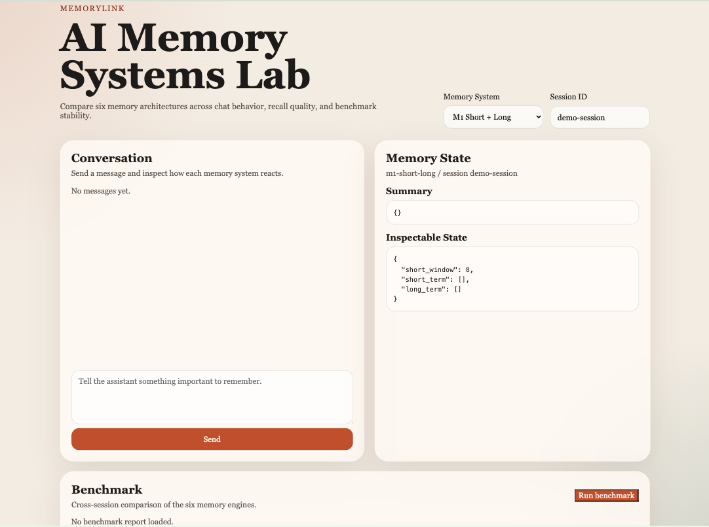

# MemoryLink

MemoryLink is a runnable comparison lab for six AI memory-system strategies. It includes:

- A FastAPI backend with six interchangeable memory engines
- A benchmark runner for cross-session recall and consistency checks
- A Next.js frontend for chat, memory inspection, and benchmark visualization
- Optional OpenAI-backed response generation with a local fallback mode

## Screenshot



## Systems

- `m1-short-long`: short-term buffer plus long-term summaries
- `m2-episodic`: event memory with emotion and timeline tagging
- `m3-semantic`: fact extraction backed by SQLite and a graph model
- `m4-procedural`: rule distillation and preference memory
- `m5-working`: importance-scored working set with archival
- `m6-hierarchical`: raw, segment, session, and profile compression layers

## Run backend

```bash
cd backend
python -m venv .venv
source .venv/bin/activate
pip install -r requirements.txt
uvicorn api.main:app --reload
```

If `OPENAI_API_KEY` is set, the backend will use `MEMORYLINK_MODEL` for real responses.
If no key is set, it falls back to a deterministic local reply generator so the lab still runs.

## Run frontend

```bash
cd frontend
npm install
npm run dev
```

Set `NEXT_PUBLIC_API_BASE_URL` if your backend is not running on `http://127.0.0.1:8000`.
