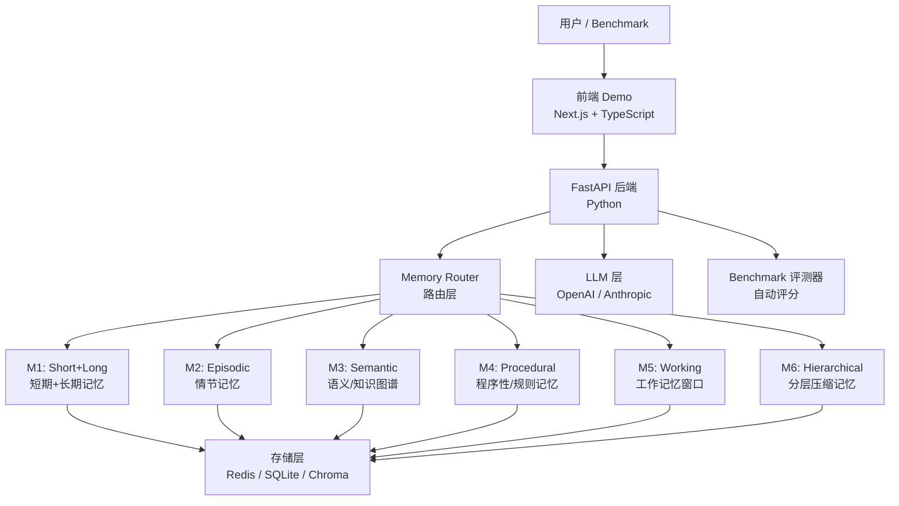

# AI Memory Systems Lab — 设计方案

## 核心命题

> "忽强忽弱的 AI，突破在记忆系统"

AI 不稳定的根本原因：每次对话都是"失忆"的新生儿。记忆系统决定 AI 能否在跨会话中保持**知识连贯、行为一致、个性稳定**。

---

## 架构总览



---

## 6 套记忆系统设计

### M1 — Short-Term + Long-Term Memory（基线）

- **短期**：最近 N 轮对话窗口（in-context buffer）
- **长期**：对话结束后提炼摘要存入向量库，下次检索召回
- **存储**：Redis（短期）+ ChromaDB（长期向量）
- **文件**：`backend/memory/short_long.py`

### M2 — Episodic Memory（情节记忆）

- 按"事件"切片存储：时间戳 + 实体 + 情绪标签
- 检索：时间近因 + 语义相似度混合排序
- 灵感来源：人类海马体情节编码
- **文件**：`backend/memory/episodic.py`

### M3 — Semantic Memory（语义/知识图谱）

- 从对话中抽取实体关系，构建知识图谱（SQLite + NetworkX）
- 检索时做图遍历 + 向量扩展
- 解决"AI不知道自己知道什么"的问题
- **文件**：`backend/memory/semantic.py`

### M4 — Procedural Memory（程序性记忆）

- 从交互中蒸馏出"行为规则"和"用户偏好"
- 规则以结构化 JSON 存储，每次对话前注入 System Prompt
- 解决"每次都要重新教"的问题
- **文件**：`backend/memory/procedural.py`

### M5 — Working Memory（工作记忆）

- 动态上下文窗口管理：重要性评分 + 主动遗忘
- 超出窗口的内容按重要性决定是否压缩到长期存储
- **文件**：`backend/memory/working.py`

### M6 — Hierarchical Compressed Memory（分层压缩）

- 原文 → 段落摘要 → 会话摘要 → 用户画像 三级结构
- 检索时按需展开，类似 MemGPT 的分页思想
- **文件**：`backend/memory/hierarchical.py`

---

## 项目目录结构

```
memorylink/
├── backend/
│   ├── memory/
│   │   ├── base.py            # 抽象基类 MemorySystem
│   │   ├── short_long.py      # M1
│   │   ├── episodic.py        # M2
│   │   ├── semantic.py        # M3
│   │   ├── procedural.py      # M4
│   │   ├── working.py         # M5
│   │   └── hierarchical.py    # M6
│   ├── api/
│   │   ├── main.py            # FastAPI 入口
│   │   ├── chat.py            # /chat 路由
│   │   └── eval.py            # /benchmark 路由
│   ├── eval/
│   │   ├── benchmark.py       # 自动评测框架
│   │   ├── test_cases.py      # 测试用例集
│   │   └── scorer.py          # 评分器
│   ├── requirements.txt
│   └── .env.example
├── frontend/
│   ├── src/
│   │   ├── app/               # Next.js App Router
│   │   ├── components/
│   │   │   ├── ChatWindow.tsx  # 对话窗口
│   │   │   ├── MemoryPanel.tsx # 实时记忆可视化
│   │   │   └── BenchmarkView.tsx
│   │   └── lib/api.ts
│   └── package.json
└── README.md
```

---

## Benchmark 评测维度

评测用例分 5 个维度，每套记忆系统在相同对话序列下跑分：

| 维度 | 测试内容 | 权重 |
|------|----------|------|
| **一致性** | 前后轮次答案矛盾率 | 30% |
| **记忆召回** | 跨会话关键信息记住率 | 25% |
| **个性稳定性** | 风格/偏好保持度 | 20% |
| **知识累积** | 新知识是否真正被记住 | 15% |
| **遗忘优雅度** | 重要信息 vs 噪声的区分 | 10% |

自动评分：LLM-as-Judge（GPT-4o 打分）+ 规则匹配

---

## 实施步骤

1. **初始化项目结构** — `backend/` Python 包 + `frontend/` Next.js 脚手架
2. **定义记忆抽象基类** — `MemorySystem` 接口（add / retrieve / summarize / clear）
3. **实现 6 套记忆引擎** — 按复杂度递进：M1 → M5 → M2 → M4 → M3 → M6
4. **搭建 FastAPI + LLM 层** — 统一 chat 接口，Memory Router 按参数切换
5. **构建 Benchmark 测试集** — 20-30 个精心设计的跨会话测试场景
6. **Next.js 前端 Demo** — 左侧对话 + 右侧记忆状态实时可视化
7. **跑通全链路评测** — 生成 6 套系统对比报告

---

## 关键技术依赖

- **Python**: FastAPI, LangChain/OpenAI SDK, ChromaDB, NetworkX, Redis
- **TypeScript**: Next.js 15, Tailwind CSS, shadcn/ui
- **存储**: SQLite（轻量，零配置）+ ChromaDB（向量）
- **LLM**: OpenAI GPT-4o（评测）+ 可插拔模型
